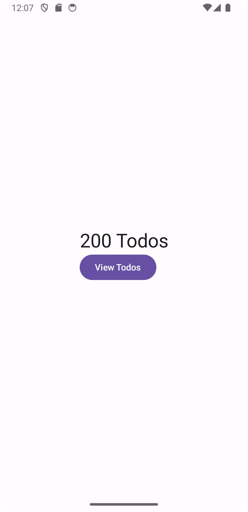
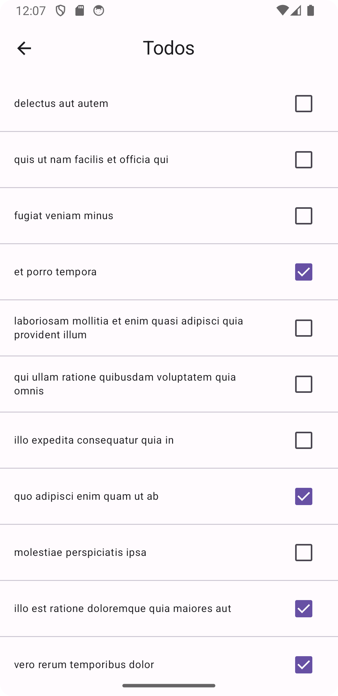

= 07-lab-android-todo
:author: Lukas Sonnleitner
:icons: font
:source-highlighter: highlight.js

== Datenmodell

[plantuml, uml, svg]
----
@startuml

class Todo {
    id: Long
    ---
    userId: Long
    title: String
    completed: boolean
}

@enduml
----

== UI

=== Overview

.todo/app/src/main/java/at/htl/todo/ui/layout/MainView.kt
[source, kotlin]
----
include::todo/app/src/main/java/at/htl/todo/ui/layout/MainView.kt[]
----

=== Todoview

.todo/app/src/main/java/at/htl/todo/ui/layout/TodoView.kt
[source, kotlin]
----
include::todo/app/src/main/java/at/htl/todo/ui/layout/TodoView.kt[]
----

== Allgemeines

Die Struktur der Applikation ist überall gleich wie bei allen (nach dem Tutorial, deswegen ist es nicht wirklich notwendig diese noch einmal herzuzeigen)

=== Fehler im Tutorial

.todo/app/src/main/AndroidManifest.xml
[source, xml]
----
include::todo/app/src/main/AndroidManifest.xml[lines=1..5]
----

Api aufrufe gehen nicht wenn diese Rechte nicht gesetzt sind. +
(Failed ohne Error 😁🔫)

=== Fehler im Programm

Wenn es Ihnen noch nicht aufgefallen ist der Back-Button bei der TodoView funktioniert nicht (Hab nix dazu gefunden 🥲)